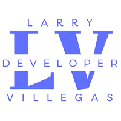

<div align="center" style="text-align: center">

  <h1><b>PROY04: Analytics - 100daysofprojects<b></h1>
</div>

[PROY04: Analytics] construido con `HTML`, `CSS` y `JavaScript`, para mejorar nuestras habilidades de codificación. Este proyecto es el cuarto de los desafios #100daysofprojects promovido por [Frontend Club](https://www.facebook.com/frontendclubfb).


### Tabla de contenidos

- [Descripcion](#descripcion)
  - [El desafio](#el-desafio)
  - [Capturas](#capturas)
  - [Enlaces](#enlaces)
- [Flujo de trabajo](#flujo-de-trabajo)
  - [Desarrollo](#desarrollo)
  - [Recursos](#recursos)
- [Agradecimientos](#agradecimientos)
- [Contacto](#contacto)
- [Licencia](#licencia)

## Descripcion

### El desafio

Crear una tarjeta de información de producto, usando `HTML` y `CSS`, y lograr que se parezca lo más posible al diseño.

### Los usuarios deberían poder:

1. Ver el diseño óptimo en pantallas `grandes(1200px)`.
2. Ver porcentajes(`tooltip`) al pasar el mouse sobre el gráfico circular.
3. Ver un color de `sombra(box-shadow)` sobre el gráfico circular.
4. `Bonus`: Agrega `efecto contador` a los números de las barritas.

### Importante:

1. Agrega icono `favicon` al proyecto.
2. Agrega una `URL` fácil de recordar (ej. `04-analytics`).
3. Agrega un `título` al proyecto (ej. `Analytics - Frontend Club`).
4. **Bonus**: Agrega un archivo `README.md` al proyecto.


### Capturas


### Enlaces

- [Proyecto](https://04-analytics-larry.netlify.app/)
- [Repositorio](https://github.com/LarryIVC/100_days_of_projects_day4)

## Flujo de trabajo

### Desarrollo

**Estructura del proyecto**

```txt
/
📂
├── 📂css/│ 
│ └── styles.css
├── 📂images/
│ └── favicon-32x32.png
│ └── logo.webp
│ └── mockup.webp
│ └── scrrenshoot.webp
├── 📂js/
│ └── index.js
└── index.html
└── LICENSE
└── README.md
```

**Tecnologías**

1. `HTML` Semántico
2. Estilos `CSS`
3. `JavaScript`
4. libreria `Chart.js`
5. `Git` y `GitHub`
6. `Netlify`

**Flujo de desarrollo**

1. Análisis del diseño
2. Configuración inicial
   - Vincular archivos y librerías
   - Iniciar proyecto con Git
3. Marcado HTML
   - Estructura semántica
   - Atributos accesibles
   - Enlaces y rutas
4. Estilos CSS
   - De arriba hacia abajo
   - Estilos reutilizables
   - Estilos personalizados
5. Flujo de trabajo `desktop-first`

**Fragmentos de codigo**

Etiquetas `meta` para el SEO.

```html
<meta name="author" content="Larry Villegas Costas" />
    <meta
      name="title"
      content="PROY04:  Analytics - Larry Villegas Costas - Frontend Club"
    />
    <meta
      name="description"
      content="PROY04:  Analytics - Larry Villegas Costas - Frontend Club"
    />
    <link rel="stylesheet" href="css/styles.css" />
    <link
      rel="icon"
      type="image/png"
      href="./images/favicon-32x32.png"
      sizes="32x32"
    />
<title>PROY04: Analytics - Larry Villegas Costas - Frontend Club</title>
```

Animaciones CSS.

```css
.seemore:hover {
  text-decoration: none;
  border: 1px solid #1a52e1;
}

```

JavaScript para el gráfico circular.

```js
const $dataContainer = document.querySelector(".data")
const lineSize = 500
if ($dataContainer) {
  let html = ""
  data.labels.forEach((label, index) => {
    html += `
    <p class="data-row">
    <span class="name">${label}</span
    ><span
      ><span class="line" style="width: ${
        (lineSize * data.datasets[0].data[index]) / 100
      }px; background: ${
      data.datasets[0].backgroundColor[index]
    }"></span><span class="value">${data.datasets[0].data[index]}%</span></span
    >
  </p>
  `
  })
  html += `<div style="text-align: right;"><a href="https://portfolio-larry.netlify.app/" target="_blank" class="seemore">See more</a></div>`
  $dataContainer.innerHTML = html
}
```

### Recursos

Comparte los recursos que hayas utilizado para completar este proyecto.

1. [Frontend Club](https://www.facebook.com/frontendclubfb) - Comunidad de desarrollo web
2. [Netlify](https://www.netlify.com/) - Plataforma de alojamiento web
3. [Multi Device Website Mockup Generator](https://techsini.com/multi-mockup/index.php) - Generador de maquetas
4. [SVGOMG](https://jakearchibald.github.io/svgomg/) - Optimizador de SVG
5. [Squoosh](https://squoosh.app/) - Optimizador de imágenes
6. [Shots](https://shots.so/) - Capturas de pantalla
7. [Google Fonts](https://fonts.google.com/) - Fuentes gratuitas
8. [Chart.js](https://www.chartjs.org/) - Librería de gráficos

## Agradecimientos

- Mi familia que siempre me apoya en mis proyectos
- Mi streeamer favorito que me inspira a seguir adelante [@midudev](https://www.twitch.tv/midudev)

## Contacto

- [LinkedIn](https://www.linkedin.com/in/larryvillegascostas/)
- [Facebook](https://www.facebook.com/profile.php?id=1201373751)
- [GitHub](https://github.com/LarryIVC)
- [Correo](mailto:larry_villegas@hotmail.com)
- [Twitter](https://twitter.com/LarryVillegas)
- [Portfolio](https://portfolio-larry.netlify.app/)

## Licencia

Este proyecto está bajo la Licencia (MIT) - mira el archivo [LICENSE](LICENSE) para detalles

*No dudes en contactarme si crees que te puedo ayudar en algún proyecto o tienes un trabajo para mi.*

